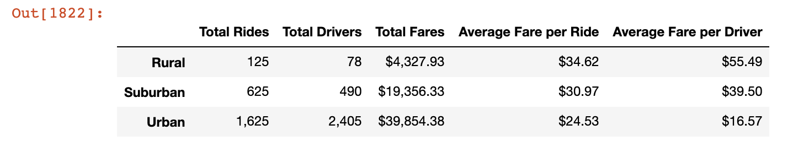

# PyBer Analysis Report

## CHALLENGE
This weeks challenge has three parts: 
- two technical analyses
- a written report that delivers your results to the CEO.

Technical Analysis Deliverable 1:
- A DataFrame that summarizes the key metrics for the ride-sharing data by city type. -  **See PyBer.ipynb Jupyter Notebook**
Technical Analysis Deliverable 2: 
- A multiple-line chart, with one line for each city type, that shows the sum of the fares for each week. -  **See PyBer.ipynb Jupyter Notebook**
Delivering Results: 
- A written report of your results, saved in a README.md document on your GitHub repository. - **See this README**

## Background and Results
Module 5 set up the initial analysis for PyBer using the Matplotlib library to plot various graph views of the PyBer data set

### Purpose
The purpose of this challenge is to provide a technical analysis and written report for the ride-sharing data. In particular we provide:
- a summary of the key metrics for the ride-sharing data by city type
- a vizualization of the total fares for each week by each city type
- a written report
  - on the results of the new analysis
  - challenges encountered and overcame during the analysis
  - future recommendations for analysis

### Technical Analysis
### How we analyzed the data to create the technical deliverables

We first produced a DataFrame to summarize the key metrics by City Type (Urban, Suburban & Rural) as follows:
- Total Rides
- Total Drivers
- Total Fares
- Average Fare per Ride ( = Total Fares / Total Rides )
- Average Fare per Driver ( = Total Fares / Total of Drivers )

We produced a line chart showing the weekly total fares per City Type for the time period indicated:
- '2019-01-01':'2019-04-28'

We can say the following with respect to the ride-sharing data among the different city types.
The summary DataFrame 
multiple-line graph 
  - Include images of the summary DataFrame table and the multiple-line graph in these results.

- A short summary of the results.

The second paragraph should include the following:

### Results

### Summary

## Challenges Encountered and Overcome

### Challenges and Difficulties Encountered

* Programming

* Data analysis

* Graphing, etc

### Technical Analyses Used

## Recommendations and Next Steps

### Recommendations for Future Analysis

### Additional Analysis 1

* Description of Approach

* Technical Steps

### Additional Analysis 2

* Description of Approach

* Technical Steps

## APPENDIX - CHALLENGE SPEC
### Delivering Results
To deliver the results of your analysis, you will submit a written analysis created for your CEO, V. Isualize, in the form of a README.md file on your GitHub repository. In your README.md, you should have three paragraphs consisting of 4 to 5 sentences each.
The first paragraph should include the following:
- Describe the purpose, or the reason, you did this assignment.
### Challenges and difficulties encountered
- If none, then briefly explain what challenges or difficulties may be encountered and how to avoid them using technical analysis.
- Explain how you overcame any challenges or difficulties, and include what technical analysis you use to overcome the challenges or difficulties.
### Recomendations
- Based on the data from the different city types, what recommendations would you give the CEO for addressing any disparities among the city types?
- Provide two additional analyses you could do to gain more insight into the data, like using other datasets.
- What technical steps would you take to perform the additional analyses?
